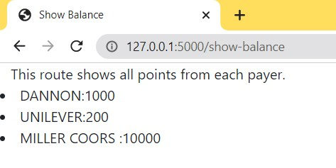
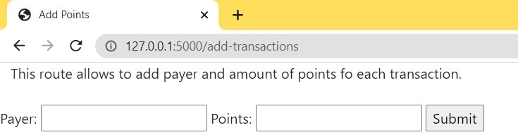
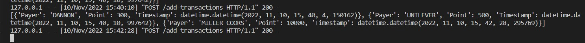
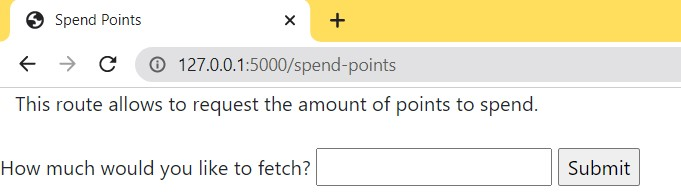
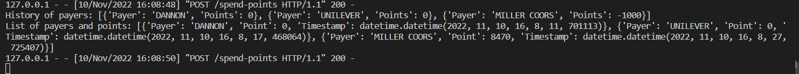
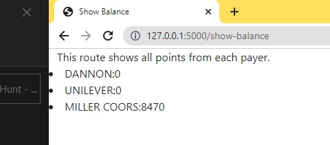

# Fetch Rewards Coding Exercise - Backend Software Engineering
## Summary


A web service that accepts HTTP requests and return responses based on the conditions outlined in the section below.

- Users have points in their account from multiple payers
- Payers submit their transactions to add/subtract points from user.
All the transactions will be stored in memory on the backend.
Payer's total points cannot go negative.
- Users can spend their points.
Oldest points are spent first accordingly in their transaction's timestamp, regardless of payer.

## Technologies
**Tech Stack:**

- Python
- Flask
- Jinja2
- HTML
- Bootstrap (only used for readability of the routes)

## Features

Show all routes




Add Transactions



Add Response:



Spend Points



Spend Points Response:

Here you can see a list from the spend call



Show Remainder Balance

Here is the final balance



## Setup/Installation
#### Requirements:
- Python 3.9
- Flask

To have this app running on your local computer, please follow the steps bellow:
Clone repository:
```
$ git clone https://github.com/karineunderwood/fetch-rewards-exercise.git
```
Create a virtual environment 🔮:
```
$ virtualenv env
```
$ source env/bin/activate
```
Install dependencies 🔗:
```
$ pip install -r requirements.txt
```
$ start the server
```
Run the app from the command line. 
```
$ python3 server.py
```
You terminal should read:
```
Running on http://172.20.47.174:5000
```
You should be able to click [Localhost](http://172.20.47.174:5000) and have access to the routes (add transaction, spend points and show balance).


